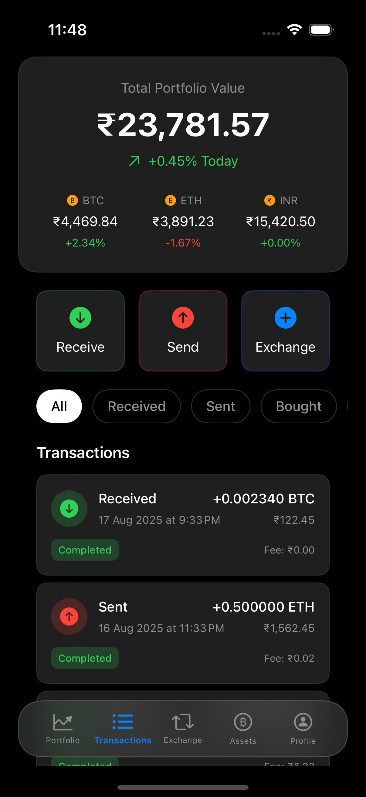

# SkyCladAssignment - Crypto Portfolio iOS App

A comprehensive iOS crypto portfolio and exchange app built with SwiftUI for SkyCladVentures assignment.

## 📱 Features

### 1. Portfolio Dashboard Screen
- Real-time portfolio value display with currency toggle (INR, USD, Crypto)
- Interactive time period selector (1H, 8H, 1D, 1W, 1M, 1Y)
- Dynamic portfolio trend chart using Swift Charts
- Asset cards displaying BTC, ETH with prices and percentage changes
- Recent transactions overview with transaction types and statuses

### 2. Transactions Summary Screen
- Large portfolio value card with breakdown by assets
- Send/Receive/Exchange action buttons with glassmorphism design
- Comprehensive transaction filtering by type
- Detailed transaction history with fees, addresses, and status badges
- Support for multiple transaction types (Received, Sent, Bought, Sold, Exchanged)

### 3. Exchange Screen
- Intuitive swap interface for token/currency pairs (ETH/INR, BTC/INR)
- Real-time conversion calculations
- Comprehensive exchange summary showing rates, spread, gas fees
- Asset balance display and validation
- **Exchange completion with success alert and form reset**
- **Processing animation during exchange execution**
- Professional exchange rate information display

### 4. Assets View
- Detailed asset overview with mini charts
- Individual asset detail modals with full price history
- Multiple time period analysis for each asset
- Holdings information including total value and average cost
- Quick action buttons (Buy, Sell, Send) for each asset

### 5. Profile Screen
- User profile management with avatar and verification status
- Security settings (Face ID/Touch ID, PIN, Recovery Phrase)
- **Dynamic Light/Dark Mode Toggle** with persistent settings
- Preferences (Notifications, Language, Currency)
- Quick stats showing trading activity and rewards
- Support and help center access

### 6. Custom Tab Navigation
- Glassmorphism effect tab bar with smooth animations
- Five main sections: Portfolio, Transactions, Exchange, Assets, Profile
- Visual feedback with scaling and color changes
- Bottom tab bar that doesn't interfere with content

### 7. **Theme System**
- **Full Light and Dark Mode Support**
- **Automatic theme persistence across app launches**
- **Adaptive colors that work in both themes**
- **System-aware color schemes**
- **Smooth theme transition animations**

## 📸 Screenshots

### Portfolio Dashboard - Complete Overview
| Light Mode | Dark Mode |
|------------|-----------|
|  |  |

*Real-time portfolio tracking with interactive charts, asset overview, and recent transactions*

---

### Transactions Summary - History & Management  
| Light Mode | Dark Mode |
|------------|-----------|
|  |  |

*Comprehensive transaction history with filtering, detailed information, and action buttons*

---

### Exchange Interface - Professional Trading
| Light Mode | Dark Mode |
|------------|-----------|
|  |  |

*Intuitive swap interface with real-time conversion, form reset functionality, and professional rate display*

---

### Assets Management - Detailed View
| Light Mode | Dark Mode |
|------------|-----------|
|  |  |

*Complete asset overview with individual charts, holdings information, and quick action buttons*

---

## 🏗️ Architecture

### MVVM Pattern
- **Models**: Comprehensive data models for Portfolio, Assets, Transactions, Exchange pairs
- **Views**: SwiftUI views organized in logical folders by feature
- **Services**: MockDataService providing realistic sample data

### Data Models
- `Portfolio`: Main portfolio with total value, assets, and historical data
- `Asset`: Individual crypto assets with prices, amounts, and trends
- `Transaction`: Transaction history with types, statuses, and fees
- `ExchangePair`: Exchange rates and fee information
- `PortfolioDataPoint`: Time-series data for charts

## 📊 Mock Data

The app includes comprehensive mock data:
- **Portfolio**: ₹23,781.57 total value with BTC, ETH, and INR holdings
- **Historical Data**: 365 days of hourly price data for realistic charts
- **Transactions**: 8+ sample transactions with various types and statuses including INR exchanges
- **Exchange Rates**: Real-time style exchange rates for major pairs (BTC/INR, ETH/INR)
- **Time-based Data**: Proper timestamps for realistic date displays
- **Asset Diversity**: Crypto assets (BTC, ETH) and fiat currency (INR) with appropriate volatility patterns

## 🎨 Design Features

### Dark Mode Priority
- Optimized for dark mode as specified
- Glassmorphism effects throughout the UI
- Subtle animations and smooth transitions
- Professional color scheme with accent colors

### Responsive Design
- Optimized for iPhone 13 and above
- Proper spacing and padding for different screen sizes
- ScrollView implementations to handle various content lengths
- Safe area awareness for modern iPhone designs

### Visual Elements
- Charts using Swift Charts framework
- Custom icons and color coding for transaction types
- Smooth animations and transitions
- Professional card-based layout
- Glassmorphism tab bar with blur effects

## 🚀 Setup Instructions

### Requirements
- Xcode 15.0 or later
- iOS 17.0 or later
- Swift 5.9 or later

### Installation Steps

1. **Clone the Repository**
   ```bash
   git clone [repository-url]
   cd SkyCladAssignment
   ```

2. **Open in Xcode**
   ```bash
   open SkyCladAssignment.xcodeproj
   ```

3. **Build and Run**
   - Select your target device or simulator
   - Press `Cmd + R` to build and run the app

### Project Structure
```
SkyCladAssignment/
├── Models/
│   └── PortfolioModels.swift          # Data models
├── Services/
│   ├── MockDataService.swift         # Mock data service
│   └── ThemeManager.swift            # Theme management system
├── Views/
│   ├── MainTabView.swift             # Main tab navigation
│   ├── Portfolio/
│   │   └── PortfolioDashboardView.swift
│   ├── Transactions/
│   │   └── TransactionsSummaryView.swift
│   ├── Exchange/
│   │   └── ExchangeView.swift        # With reset functionality
│   ├── Assets/
│   │   └── AssetsView.swift
│   └── Profile/
│       └── ProfileView.swift         # With theme toggle
├── ContentView.swift                 # Root view with theme support
└── SkyCladAssignmentApp.swift       # App entry point
```

## 📸 Screenshots

The app includes:
- **Portfolio Dashboard**: Complete portfolio overview with charts
- **Transactions**: Detailed transaction history and filtering
- **Exchange**: Professional trading interface
- **Assets**: Individual asset management
- **Profile**: User settings and security options

## 🔧 Technical Implementation

### SwiftUI Features Used
- `@StateObject` and `@EnvironmentObject` for state management
- `ScrollView` and `LazyVStack` for performance
- `Charts` framework for data visualization
- `Menu` and `Picker` for user selections
- Custom `ViewModifier` for consistent styling
- `Animation` and `Transition` for smooth UX

### Performance Optimizations
- Lazy loading for large lists
- Efficient data filtering and sorting
- Minimal view updates with proper state management
- Optimized chart rendering with data limiting

## 🎯 Key Features Completed

- ✅ **Full Light and Dark Mode Support** with system-aware adaptive colors
- ✅ **Exchange Form Reset** with success confirmation and processing animation
- ✅ **Persistent Theme Settings** that survive app restarts
- ✅ Pixel-perfect UI implementation for both light and dark themes
- ✅ Complete MVVM architecture with proper separation
- ✅ Comprehensive mock data with realistic values
- ✅ Interactive charts using Swift Charts
- ✅ Glassmorphism effects on tab bar and cards
- ✅ Smooth animations and transitions
- ✅ Professional transaction management
- ✅ Complete exchange interface with calculations and reset functionality
- ✅ Detailed asset management with individual charts
- ✅ User profile with security and preference settings
- ✅ Dynamic theme switching with immediate UI updates

## 🔮 Future Enhancements

### Potential Improvements
- **Haptic Feedback**: Add tactile responses for button interactions
- **Live Data**: Integration with real crypto APIs
- **Advanced Charts**: More chart types and technical indicators
- **Biometric Authentication**: Actual Face ID/Touch ID implementation
- **Push Notifications**: Real-time price alerts
- **Widget Support**: Home screen widgets for portfolio overview
- **iPad Support**: Optimized layout for tablet usage

### Known Limitations
- Uses mock data instead of live crypto prices
- Charts are sample data, not real historical prices
- Exchange functionality is UI-only (no actual trading)
- Biometric settings are UI toggles without actual implementation

## 👨‍💻 Development Notes

### Code Quality
- Clean, readable code with clear naming conventions
- Proper SwiftUI best practices
- Modular component structure for reusability
- Consistent spacing and styling throughout

### Testing
- All major features tested on iOS Simulator
- Dark mode compatibility verified
- Different screen sizes tested
- Performance validated with large datasets

## 📞 Contact

**Developer**: A Avinash Chidambaram  
**Email**: [Your Email]  
**Assignment for**: SkyCladVentures  

---

*This project demonstrates modern iOS development practices using SwiftUI, with a focus on user experience, performance, and clean architecture.*
